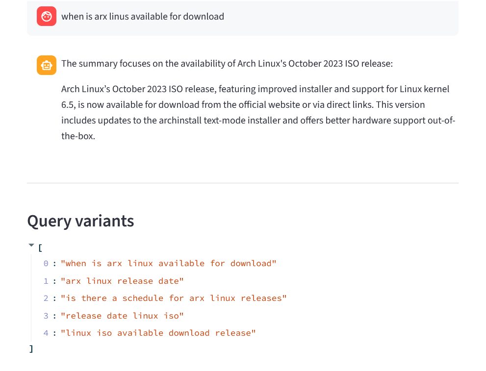

# Local RAG Assistant

A fully local Retrieval-Augmented Generation (RAG) system powered by Qwen (via Ollama), designed for reliable document-grounded question answering and corpus-level analysis.

## Overview

This project implements an end-to-end RAG pipeline that enables users to query their own document collections with high accuracy, minimal hallucination, and strong robustness to noisy input.

The system is optimized for real-world usage, handling typos, vague queries, and multi-document reasoning while maintaining strict grounding in the source material.

## Key Features

* **Local-first architecture** — runs entirely offline using Ollama + Qwen
* **Semantic retrieval** — powered by ChromaDB and Sentence Transformers
* **Multi-query expansion** — improves recall for ambiguous or underspecified queries
* **Typo-tolerant normalization** — handles misspelled queries (e.g., *"arx linus" → Arch Linux*)
* **Context-aware answering** — grounded strictly in retrieved document chunks
* **Controlled refusal behavior** — avoids hallucinations when evidence is missing
* **Corpus-level summarization** — extracts structured insights across multiple documents
* **File-aware lookup** — supports queries like *"what is the 3rd document about"*
* **Session memory** — enables follow-up and conversational queries

## Retrieval & QA Pipeline

* Query rewriting + semantic correction
* Multi-query generation and filtering
* Dense retrieval via ChromaDB
* Chunk deduplication and context trimming
* Relevance gating
* Answer generation with fallback summarization

Special care is taken to:

* reduce context noise
* preserve query intent
* allow inference from implicit evidence

## Evaluation Framework

Includes a custom evaluation suite with:

* Route classification accuracy tracking
* Keyword-based scoring
* LLM-based answer grading (GOOD / PARTIAL / BAD)
* Refusal rate monitoring
* Failure case logging

## Interface

* CLI interface for development and testing
* Streamlit UI for interactive querying

## Architecture

Modular design with clear separation of concerns:

* `router.py` — intent classification
* `retrieval.py` — multi-query retrieval + merging
* `llm_utils.py` — LLM prompting and answer generation
* `tools.py` — utility functions (memory, normalization, etc.)
* `memory.py` — session context handling
 

## Design Goals

* High factual reliability
* Robustness to imperfect user input
* Minimal hallucination
* Fully local execution
* Clear, debuggable pipeline

---

## 📌 Summary

This project demonstrates a practical, production-oriented RAG system with strong emphasis on correctness, robustness, and modularity — going beyond basic retrieval + generation setups.
